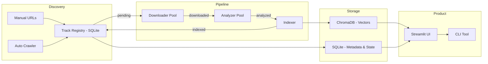

# Deepkt — Scalable Architecture Plan

## Goal
Restructure Deepkt into a production-grade engine capable of indexing **1 million+ tracks** with configurable feature extraction, parallel processing, automated crawling with quality control, and full track searchability.

---

## Open Decisions

- [ ] Finalize quality gate criteria (basic version: title/hashtag/artist filtering, detailed version TBD)
- [ ] Determine Talapas config if/when switching from local
- [ ] Decide on user-facing feature toggle UI design (future)

---

## Architecture Overview



---

## Environment

**Primary**: Local machine (macOS, Python 3.12 venv)
**Future option**: UO Talapas cluster — pipeline is designed to be environment-agnostic (config-driven worker counts, no hardcoded paths). Switching to Talapas later = change `config/pipeline.yaml` values and deploy the venv.

---

## Project Structure

```
HyperPhonkCurator/
├── config/
│   ├── features.yaml           # DNA Recipe — which features, weights, params
│   ├── crawler.yaml            # Crawl sources, rate limits, quality gates
│   └── pipeline.yaml           # Worker counts, batch sizes, temp dirs
│
├── deepkt/                   # Core Python package
│   ├── __init__.py
│   ├── config.py               # Load & validate YAML configs
│   ├── db.py                   # SQLite track registry (metadata + state)
│   ├── indexer.py              # ChromaDB read/write operations
│   ├── crawler.py              # URL discovery (SoundCloud tags, related, YT)
│   ├── downloader.py           # yt-dlp wrapper with retry/rate-limit
│   ├── analyzer.py             # Orchestrates feature extraction from config
│   ├── pipeline.py             # Parallel batch pipeline coordinator
│   ├── quality.py              # Quality gate logic (accept/reject tracks)
│   └── features/               # Pluggable feature extractors
│       ├── __init__.py         # Feature registry (auto-discovers extractors)
│       ├── base.py             # BaseFeatureExtractor interface
│       ├── tempo.py            # BPM extraction
│       ├── mfcc.py             # MFCC coefficients
│       ├── spectral.py         # Centroid, rolloff, bandwidth, contrast
│       ├── rhythm.py           # Zero-crossing rate, onset strength
│       └── chroma.py           # Chroma features (pitch class profiles)
│
├── app.py                      # Streamlit UI (thin layer over deepkt/)
├── cli.py                      # CLI: ingest, crawl, search, stats, export
├── data/
│   ├── chroma_db/              # Vector storage
│   └── tracks.db               # SQLite metadata database
└── .venv/                      # Python 3.12 environment
```

---

## Key Components

### 1. Dual Database Design

| | SQLite (`tracks.db`) | ChromaDB (`chroma_db/`) |
|---|---|---|
| **Purpose** | Track metadata & processing state | Vector storage & similarity search |
| **Contains** | URL, artist, title, source, status, timestamps, error log, feature_version | DNA vector embeddings |
| **Query use** | "Show me all failed tracks", "Which tracks are pending?", "Search by artist" | "Find 10 most similar tracks to this vector" |
| **Scale** | Handles 10M+ rows trivially | HNSW index handles 1M+ vectors |

**Track states:** `DISCOVERED → DOWNLOADING → DOWNLOADED → ANALYZING → INDEXED → (REJECTED)`

Each state transition is recorded with timestamp. Crashed jobs resume from last known state.

---

### 2. Configurable Feature Extraction

**`config/features.yaml`** example:

```yaml
version: 2               # Increment when changing features → triggers re-index
features:
  tempo:
    enabled: true
    dimensions: 1
  mfcc:
    enabled: true
    n_coefficients: 13
    dimensions: 13
  spectral_centroid:
    enabled: true
    dimensions: 1
  zero_crossing_rate:
    enabled: true
    dimensions: 1
  # --- Easy to add later ---
  # spectral_rolloff:
  #   enabled: false
  #   dimensions: 1
  # chroma:
  #   enabled: false
  #   dimensions: 12
```

Each extractor implements a simple interface:

```python
class BaseFeatureExtractor:
    name: str
    dimensions: int

    def extract(self, y, sr, config) -> list[float]:
        """Given audio array + sample rate, return feature values."""
```

The analyzer reads `features.yaml`, loads only enabled extractors, and concatenates outputs. **When `version` increments, the system knows all vectors are stale and need re-extraction.**

Eventually this config becomes user-facing — users can toggle which features matter for their searches.

---

### 3. Parallel Processing Pipeline

```
┌──────────────┐    ┌──────────────┐    ┌──────────────┐
│  Download     │    │  Analyze     │    │  Index       │
│  Worker Pool  │───▶│  Worker Pool │───▶│  (Batched)   │
│  (I/O bound)  │    │  (CPU bound) │    │              │
│  8 workers    │    │  N workers   │    │  100 at a    │
│  asyncio      │    │  multiproc   │    │  time        │
└──────────────┘    └──────────────┘    └──────────────┘
```

**`config/pipeline.yaml`** governs worker counts, making it trivial to scale up on Talapas:

```yaml
download_workers: 8       # Local default, bump to 32 on Talapas
analyze_workers: 4        # Match core count (auto-detect option)
index_batch_size: 100
temp_dir: /tmp/deepkt   # Configurable for cluster storage
```

- **Downloads**: I/O-bound → thread pool
- **Analysis**: CPU-bound → multiprocessing (matches core count)
- **Indexing**: Batch inserts 100-500 at a time
- **Temp files**: Download → analyze → delete MP3 immediately (no storage buildup)
- **Progress**: Rich progress bars, ETA, auto-save state

**Estimated throughput** (8-core local): ~1 track/second → ~12 days for 1M tracks running continuously.

---

### 4. Quality Gates (Basic Version)

**Basic filtering** (v1 — what we build now):
- **Title keywords**: Reject tracks containing blocklist words (e.g., "podcast", "lecture", "ASMR")
- **Hashtag matching**: When crawling by tag, require at least one relevant tag on the track (e.g., `phonk`, `trap`, `darkwave`, `drift`)
- **Artist allowlist/blocklist**: Optionally seed with known-good artists; flag unknown artists for review
- **Duration check**: Skip tracks < 30s or > 15min

**All configurable in `crawler.yaml`:**
```yaml
quality_gates:
  min_duration_seconds: 30
  max_duration_seconds: 900
  title_blocklist: ["podcast", "lecture", "asmr", "interview", "remix contest"]
  required_tags: ["phonk", "trap", "darkwave", "drift", "dark trap", "wave"]
  tag_match_mode: "any"  # "any" = at least one tag matches, "all" = all must match
```

**Advanced filtering (future — to design later):**
- Post-analysis vector similarity check against seed cluster
- Genre classification model
- Configurable "vibe space" boundaries

---

### 5. CLI Tool

```bash
# Crawl & ingest
deepkt crawl --source soundcloud --tags "phonk,dark trap" --limit 5000
deepkt ingest --file urls.txt
deepkt process --workers 8 --batch-size 100

# Search & inspect
deepkt search "HXVRMXN"                    # Find tracks by artist/title
deepkt inspect <track-id>                  # Show vector, metadata, source URL
deepkt similar <track-id> --top 10         # Find similar from CLI

# Maintenance
deepkt stats                               # Total indexed, pending, failed
deepkt retry-failed                        # Re-attempt failed tracks
deepkt reindex                             # Re-extract all vectors (after config change)
deepkt export --format csv                 # Export metadata
```

---

## Execution Order

| Phase | What | Why first |
|-------|------|-----------|
| **A** | Project restructure → `deepkt/` package | Everything builds on this |
| **B** | SQLite track registry + Feature config system | Needed before any batch processing |
| **C** | Parallel pipeline (`pipeline.py`) | Core throughput engine |
| **D** | CLI tool | Operate the pipeline without the UI |
| **E** | Automated crawler + quality gates | Scale data acquisition |
| **F** | UI updates (search, admin, feature toggles) | Polish after core works |

Phases A-D give you a fully operational batch engine you can start filling overnight.
Phase E automates discovery. Phase F is product polish.

---

## Notes

- **SoundCloud API is closed** to new registrations. Crawling relies on `yt-dlp`'s SoundCloud scraping (functional but rate-limited — factor into crawl speed expectations).
- **MP3s are deleted after vectorization** — only vectors + metadata persist. At 1M tracks the vector DB + SQLite will be well under 5GB total.
- **Feature version tracking** means you can change your DNA recipe and re-index without losing track metadata.
