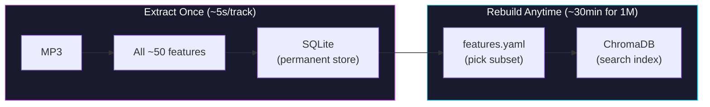

# Phase B: Feature Store + Config-Driven Search Index

## Objective
Build a two-layer system that **extracts all features once** and lets you **adjust the search recipe without re-processing**:

1. **Feature Store** (SQLite) — extracts and stores ALL ~50 feature values per track permanently
2. **Search Index** (ChromaDB) — built from a configurable subset of stored features, rebuildable in minutes



**Key win**: Changing your DNA recipe = rebuild search index from SQLite (minutes), not re-download + re-analyze audio (weeks).

**Total features**: 43 dimensions stored per track (9 extractor groups). 16 enabled for search by default.

---

## User Decisions Incorporated

- **Manual reindex only** — changing `features.yaml` warns you but waits for `cli.py reindex`
- **OK to wipe existing ChromaDB** and re-index the 10 current tracks through the new pipeline
- **Extract everything upfront** so future feature changes don't require re-processing

---

## Part 1: Pluggable Feature Extractors

### Step 1: Create individual extractor modules

Each implements `BaseFeatureExtractor`. ALL run during analysis regardless of config — the config only controls which go into the search index.

#### [NEW] `deepkt/features/tempo.py`
```python
class TempoExtractor(BaseFeatureExtractor):
    name = "tempo"
    dimensions = 1
    def extract(self, y, sr, config=None):
        # librosa.beat.beat_track → return [float(bpm)]
```

#### [NEW] `deepkt/features/mfcc.py`
```python
class MFCCExtractor(BaseFeatureExtractor):
    name = "mfcc"
    dimensions = 13  # configurable via n_coefficients
    def extract(self, y, sr, config=None):
        # librosa.feature.mfcc → return averaged coefficients
```

#### [NEW] `deepkt/features/spectral.py`
```python
class SpectralCentroidExtractor(BaseFeatureExtractor):
    name = "spectral_centroid"
    dimensions = 1
    def extract(self, y, sr, config=None):
        # librosa.feature.spectral_centroid → return [float(mean)]

class SpectralContrastExtractor(BaseFeatureExtractor):
    name = "spectral_contrast"
    dimensions = 7
    def extract(self, y, sr, config=None):
        # librosa.feature.spectral_contrast → return 7 band averages
```

#### [NEW] `deepkt/features/rhythm.py`
```python
class ZeroCrossingRateExtractor(BaseFeatureExtractor):
    name = "zero_crossing_rate"
    dimensions = 1

class OnsetStrengthExtractor(BaseFeatureExtractor):
    name = "onset_strength"
    dimensions = 1

class RMSEnergyExtractor(BaseFeatureExtractor):
    name = "rms_energy"
    dimensions = 1
    def extract(self, y, sr, config=None):
        # librosa.feature.rms → return [float(mean)]
```

#### [NEW] `deepkt/features/chroma.py`
```python
class ChromaExtractor(BaseFeatureExtractor):
    name = "chroma"
    dimensions = 12
    def extract(self, y, sr, config=None):
        # librosa.feature.chroma_stft → 12 pitch class averages
```

#### [NEW] `deepkt/features/tonnetz.py`
```python
class TonnetzExtractor(BaseFeatureExtractor):
    name = "tonnetz"
    dimensions = 6
    def extract(self, y, sr, config=None):
        # librosa.feature.tonnetz → 6 harmonic relationship values
        # [fifths, minor_thirds, major_thirds, diminished, minor_mvmt, major_mvmt]
        # Key for Phonk: dim[1] (minor thirds) captures the signature minor-key sound
```

**Total: 9 extractor groups, 43 dimensions.** Covers tempo, timbre, brightness, grit, harmonic theory, rhythm, and spectral shape.

### Step 2: Feature registry

#### [MODIFY] `deepkt/features/__init__.py`

```python
EXTRACTOR_REGISTRY = {
    "tempo": TempoExtractor,
    "mfcc": MFCCExtractor,
    "spectral_centroid": SpectralCentroidExtractor,
    "spectral_contrast": SpectralContrastExtractor,
    "zero_crossing_rate": ZeroCrossingRateExtractor,
    "onset_strength": OnsetStrengthExtractor,
    "rms_energy": RMSEnergyExtractor,
    "chroma": ChromaExtractor,
    "tonnetz": TonnetzExtractor,
}

ALL_EXTRACTORS = list(EXTRACTOR_REGISTRY.values())
```

---

## Part 2: Config System

### Step 3: Create `deepkt/config.py`

#### [NEW] `deepkt/config.py`

```python
def load_feature_config(config_path="config/features.yaml"):
    """Load features.yaml, returns dict."""

def get_enabled_features(config_path="config/features.yaml"):
    """Return list of feature names marked enabled: true."""

def get_search_dimensions(config_path="config/features.yaml"):
    """Total dimensions of the search vector (sum of enabled feature dims)."""

def get_feature_version(config_path="config/features.yaml"):
    """Hash of enabled features — changes when search recipe changes."""

def get_all_feature_names():
    """Return ordered list of ALL feature names (for the full store)."""

def get_search_feature_names(config_path="config/features.yaml"):
    """Return ordered list of ENABLED feature names (for UI labels)."""
```

### Step 4: Update `config/features.yaml`

```yaml
version: 2

# "enabled" = included in the SEARCH INDEX (ChromaDB)
# ALL features are always EXTRACTED and stored in SQLite regardless
features:
  tempo:
    enabled: true
    dimensions: 1
  mfcc:
    enabled: true
    n_coefficients: 13
    dimensions: 13
  spectral_centroid:
    enabled: true
    dimensions: 1
  zero_crossing_rate:
    enabled: true
    dimensions: 1
  spectral_contrast:       # Extracted + stored, but NOT searched on (yet)
    enabled: false
    dimensions: 7
  onset_strength:
    enabled: false
    dimensions: 1
  rms_energy:
    enabled: false
    dimensions: 1
  chroma:
    enabled: false
    dimensions: 12
  tonnetz:                 # Minor thirds detection — key for Phonk harmonic signature
    enabled: false
    dimensions: 6
```

---

## Part 3: SQLite Feature Store + Track Registry

### Step 5: Create `deepkt/db.py`

#### [NEW] `deepkt/db.py`

**Two tables** — one for track lifecycle, one for raw features:

```sql
-- Track metadata and processing state
CREATE TABLE tracks (
    id              TEXT PRIMARY KEY,    -- e.g. "HXVRMXN - Eclipse.mp3"
    url             TEXT,                -- source URL
    artist          TEXT NOT NULL,
    title           TEXT NOT NULL,
    source          TEXT DEFAULT 'manual',
    status          TEXT DEFAULT 'DISCOVERED',
    error_message   TEXT,
    discovered_at   TIMESTAMP DEFAULT CURRENT_TIMESTAMP,
    indexed_at      TIMESTAMP,
    updated_at      TIMESTAMP DEFAULT CURRENT_TIMESTAMP
);

-- Raw feature values (ALL extractors, not just enabled ones)
CREATE TABLE track_features (
    track_id        TEXT PRIMARY KEY REFERENCES tracks(id),
    feature_data    TEXT NOT NULL,        -- JSON: {"tempo": [143.5], "mfcc": [-20.4, 65.2, ...], ...}
    extractor_count INTEGER,             -- number of extractors that ran
    extracted_at    TIMESTAMP DEFAULT CURRENT_TIMESTAMP
);
```

**Why JSON for feature_data?** Because different extractors produce different dimension counts. `{"tempo": [143.5], "mfcc": [-20.4, 65.2, ...13 values...], "chroma": [0.3, 0.1, ...12 values...]}`. Easy to select a subset.

**Key functions:**
```python
def get_db(db_path="data/tracks.db") -> Connection
def register_track(track_id, artist, title, url=None, source="manual")
def update_status(track_id, status, error=None)
def store_features(track_id, feature_dict)     # {"tempo": [143.5], ...}
def get_features(track_id) -> dict
def get_all_features() -> list[dict]           # for batch reindex
def get_tracks(status=None, limit=None)
def search_tracks(query)                       # text search
def get_stats() -> dict                        # counts by status
```

---

## Part 4: Rewrite Analyzer + Indexer

### Step 6: Rewrite `deepkt/analyzer.py`

#### [MODIFY] `deepkt/analyzer.py`

The analyzer now runs ALL extractors and returns a dict, not a list:

**Before:**
```python
def analyze_snippet(file_path):
    # hardcoded: BPM + 13 MFCCs + centroid + ZCR
    return [float(tempo)] + mfccs + [centroid, zcr]  # list of 16 floats
```

**After:**
```python
def analyze_snippet(file_path):
    y, sr = librosa.load(file_path)
    y_trimmed, _ = librosa.effects.trim(y, top_db=20)

    feature_dict = {}
    for extractor_cls in ALL_EXTRACTORS:
        ext = extractor_cls()
        feature_dict[ext.name] = ext.extract(y_trimmed, sr)

    return feature_dict
    # {"tempo": [143.5], "mfcc": [-20.4, ...], "chroma": [0.3, ...], ...}

def build_search_vector(feature_dict, config_path="config/features.yaml"):
    """Select enabled features from stored dict → flat list for ChromaDB."""
    enabled = get_enabled_features(config_path)
    vector = []
    for name in enabled:
        vector.extend(feature_dict[name])
    return vector
```

### Step 7: Rewrite `deepkt/indexer.py`

#### [MODIFY] `deepkt/indexer.py`

Two distinct operations:

```python
def analyze_and_store(data_dir="data/raw_snippets"):
    """Analyze all MP3s → store ALL features in SQLite. (Expensive, once per track)"""
    for mp3 in mp3_files:
        feature_dict = analyze_snippet(mp3)
        db.store_features(track_id, feature_dict)
        db.update_status(track_id, "ANALYZED")

def rebuild_search_index(config_path="config/features.yaml"):
    """Read stored features → build ChromaDB with enabled subset. (Cheap, minutes)"""
    all_features = db.get_all_features()
    # Wipe old collection, create new one
    for track in all_features:
        vector = build_search_vector(track["feature_data"])
        collection.add(ids=[track_id], embeddings=[vector], ...)

def query_similar(query_vector, ...):
    # Same as before — searches ChromaDB
```

---

## Part 5: Update CLI and App

### Step 8: Update `cli.py`

| Command | What it does |
|---------|-------------|
| `cli.py analyze` | Run all extractors on MP3s → store in SQLite (expensive) |
| `cli.py reindex` | Rebuild ChromaDB from SQLite using current `features.yaml` (cheap) |
| `cli.py stale` | Check if search index matches current config |
| `cli.py features` | Show all available features and which are enabled |
| `cli.py stats` | Track counts by status from SQLite |
| `cli.py search` | Text search from SQLite |
| `cli.py inspect <id>` | Show ALL stored features for a track |

### Step 9: Update `app.py`

- `FEATURE_NAMES` generated dynamically from enabled features
- Library dropdown from SQLite
- Sidebar shows "Search features: 16/50 dimensions enabled"

---

## Anticipated Errors & Mitigations

### Error 1: ChromaDB dimension mismatch
**When**: Search index was built with 16 dims, config changes to 17 dims
**Fix**: `rebuild_search_index` drops and recreates the collection. Never mix dimensions.

### Error 2: Missing features for old tracks
**When**: You add a new extractor (e.g., `spectral_flatness`) but old tracks in SQLite don't have it
**Fix**: Their `feature_data` JSON won't have the key. The system detects this and marks them as needing re-analysis. Only these tracks need re-processing — not all 1M.

### Error 3: SQLite locked during parallel writes (Phase C)
**Fix**: Use `PRAGMA journal_mode=WAL` (Write-Ahead Logging) — allows concurrent reads during writes.

### Error 4: `pyyaml` not installed
**Fix**: `pip install pyyaml` — add to requirements.

### Error 5: Feature extractor order changes
**When**: Reordering features in YAML produces incompatible vectors
**Fix**: `build_search_vector` always selects features in alphabetical order by name, not YAML order. Deterministic.

### Error 6: JSON storage performance at 1M rows
**When**: Scanning 1M JSON blobs during reindex
**Fix**: SQLite handles this fine — 1M rows × ~500 bytes = ~500MB. A full scan takes seconds. If it ever becomes slow, we add a flat binary column, but this won't be an issue.

---

## Execution Checklist

1. [ ] Install `pyyaml`
2. [ ] Create `deepkt/features/tempo.py`
3. [ ] Create `deepkt/features/mfcc.py`
4. [ ] Create `deepkt/features/spectral.py` (centroid, contrast)
5. [ ] Create `deepkt/features/rhythm.py` (ZCR, onset strength, RMS energy)
6. [ ] Create `deepkt/features/chroma.py`
7. [ ] Create `deepkt/features/tonnetz.py`
8. [ ] Update `deepkt/features/__init__.py` with registry
9. [ ] Create `deepkt/config.py`
10. [ ] Update `config/features.yaml` with all 9 extractors
11. [ ] Rewrite `deepkt/analyzer.py` (dict output, run all extractors)
12. [ ] Create `deepkt/db.py` (SQLite: tracks + track_features)
13. [ ] Rewrite `deepkt/indexer.py` (analyze_and_store + rebuild_search_index)
14. [ ] Wipe existing ChromaDB, re-analyze 10 tracks through new pipeline
15. [ ] Update `cli.py` (analyze, reindex, stale, features, inspect)
16. [ ] Update `app.py` (dynamic feature names, SQLite integration)
17. [ ] Update `tests/` for all new code
18. [ ] Verify: toggle feature in YAML → reindex → search still works
19. [ ] Verify: `cli.py inspect` shows all 43 stored features per track
