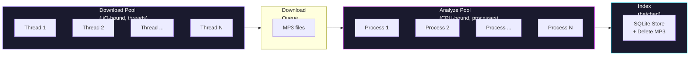

# Phase C: Parallel Processing Pipeline

## Objective
Transform the current sequential `analyze_and_store` loop into a parallel pipeline that can process thousands of tracks overnight. Three concurrent stages with automatic MP3 cleanup:



---

## Current State vs Target

| | Current (`analyze_and_store`) | Target (`pipeline.py`) |
|---|---|---|
| Download | Sequential (1 at a time) | Thread pool (configurable, default 4) |
| Analysis | Sequential (1 at a time) | Process pool (auto-detect cores) |
| Index/store | One-by-one SQLite inserts | Batched inserts (100 at a time) |
| MP3 cleanup | Never (accumulates on disk) | Immediately after analysis |
| Progress | Print statements | Rich progress bars + ETA |
| Resume | Skips by filename match | SQLite status tracking (crash-safe) |
| Error handling | Skip + print | Retry queue + error logging to SQLite |
| Speed (8-core Mac) | ~1 track/8s | ~1 track/s |

---

## Part 1: Pipeline Configuration

### Step 1: Create `config/pipeline.yaml`

#### [NEW] `config/pipeline.yaml`

```yaml
# Pipeline configuration — worker counts and behavior
download:
  workers: 4              # Concurrent download threads
  rate_limit_pause: 2.0   # Seconds between downloads per thread
  max_retries: 3          # Retry failed downloads

analysis:
  workers: auto           # "auto" = os.cpu_count(), or set an integer
  timeout: 120            # Max seconds per track before timeout

indexing:
  batch_size: 100         # SQLite/ChromaDB batch insert size

cleanup:
  delete_mp3_after: true  # Delete MP3 immediately after feature extraction
  temp_dir: data/tmp      # Temporary directory for downloads during pipeline

progress:
  show_bar: true
  log_file: data/pipeline.log
```

### Step 2: Add pipeline config loading to `config.py`

#### [MODIFY] `deepkt/config.py`

Add `load_pipeline_config()` function alongside existing feature config loading.

---

## Part 2: Pipeline Coordinator

### Step 3: Create `deepkt/pipeline.py`

#### [NEW] `deepkt/pipeline.py`

The core parallel coordinator using `concurrent.futures`:

```python
def run_pipeline(urls=None, links_file=None, config_path=None):
    """Run the full download → analyze → store pipeline in parallel.
    
    Three concurrent stages connected by queues:
    1. Download pool (ThreadPoolExecutor — I/O-bound)
    2. Analysis pool (ProcessPoolExecutor — CPU-bound) 
    3. Storage loop (single thread — batched SQLite writes)
    """
```

**Key design decisions:**

- **ThreadPoolExecutor for downloads** — downloads are I/O-bound (waiting on network). Threads share memory, low overhead.
- **ProcessPoolExecutor for analysis** — librosa feature extraction is CPU-bound. Separate processes bypass the GIL.
- **Single-thread for storage** — SQLite writes must be serialized. Batching 100 inserts at a time keeps it fast.
- **Queue-based flow** — `queue.Queue` connects stages. Download workers push MP3 paths, analysis workers push feature dicts.

**Flow per track:**
```
1. Download thread picks URL → downloads MP3 to temp_dir
2. Download thread updates SQLite status: DOWNLOADING → DOWNLOADED
3. Download thread puts MP3 path on the analysis queue
4. Analysis process picks MP3 → runs all 9 extractors (43 dims)
5. Analysis process puts {track_id, features} on the storage queue
6. Storage loop batch-inserts to SQLite
7. Storage loop updates status: ANALYZING → INDEXED
8. Storage loop deletes the MP3 file
```

**Crash recovery:**
- On startup, check SQLite for tracks in DOWNLOADING or ANALYZING state
- Re-queue them (the MP3 might still exist in temp_dir)
- Tracks in DISCOVERED state haven't started yet — safe to skip

### Step 4: Progress tracking

Use Python's built-in `logging` module + optional `rich` progress bars if installed:

```python
# Fallback to basic progress if rich isn't installed
try:
    from rich.progress import Progress, BarColumn, TimeElapsedColumn
    HAS_RICH = True
except ImportError:
    HAS_RICH = False
```

Progress shows per-stage counts:
```
⬇️  Downloading   [████████░░░░] 342/500  (4 workers)
🧬 Analyzing     [██████░░░░░░] 298/500  (8 workers)
💾 Stored        [█████░░░░░░░] 250/500
🗑️  Cleaned up    250 MP3s deleted
⏱️  ETA: ~4 min
```

---

## Part 3: Modify Downloader for Single-Track Returns

### Step 5: Add `download_single` to downloader.py

#### [MODIFY] `deepkt/downloader.py`

The current `download_snippets` takes a list and doesn't return file paths. The pipeline needs a function that:
1. Downloads ONE url to a specific temp dir
2. Returns the file path (or raises on failure)
3. Extracts metadata (artist, title) from yt-dlp info

```python
def download_single(url, output_dir="data/tmp"):
    """Download a single track. Returns (file_path, artist, title) or raises."""
```

---

## Part 4: Wire Into CLI

### Step 6: Add `pipeline` command to CLI

#### [MODIFY] `cli.py`

```bash
# Run the full pipeline
python cli.py pipeline --file links.txt --workers 4
python cli.py pipeline --file links.txt --workers 8 --no-cleanup

# Resume after crash
python cli.py pipeline --resume

# Pipeline status
python cli.py pipeline-status
```

---

## Part 5: Post-Pipeline Search Index Rebuild

### Step 7: Auto-prompt for reindex

After the pipeline completes, print a summary and prompt:
```
Pipeline complete!
  ✅ 487 tracks downloaded and analyzed
  ❌ 13 tracks failed (see 'cli.py stats' for details)
  🗑️  487 MP3 files cleaned up

💡 Run 'cli.py reindex' to rebuild the search index with the new tracks.
```

The pipeline does NOT auto-rebuild ChromaDB — it only stores features in SQLite. The user runs `reindex` manually when ready (matches the decision from Phase B).

---

## Anticipated Errors & Mitigations

### Error 1: SQLite "database is locked" under concurrent writes
**When**: Multiple analysis processes try to write features simultaneously.
**Why**: SQLite supports one writer at a time. Process pool workers might collide.
**Fix**: All SQLite writes happen in the single storage thread, never in worker processes. Workers return results via `Queue`; only the main thread touches the DB. This is the critical design choice.

### Error 2: yt-dlp rate limiting / IP bans
**When**: Downloading too many tracks too fast from SoundCloud.
**Why**: SoundCloud rate-limits aggressively (~2-4 req/s before throttling).
**Fix**: Per-thread rate limiting (`rate_limit_pause` in config). Default 2s between downloads per thread. With 4 threads = ~2 downloads/second globally. Add exponential backoff on HTTP 429 errors.

### Error 3: Analysis process hanging on corrupt MP3
**When**: A corrupt or truncated MP3 causes librosa to hang indefinitely.
**Fix**: `timeout` config (default 120s). Use `concurrent.futures` with `result(timeout=120)`. If timeout expires, mark track FAILED in SQLite and move on.

### Error 4: Disk filling up with temp MP3s during crash
**When**: Pipeline crashes after downloading 5000 MP3s but before analyzing them.
**Fix**: On resume, scan `temp_dir` for existing MP3s and re-queue them for analysis. After successful pipeline run, clean entire temp dir.

### Error 5: ProcessPoolExecutor pickling errors
**When**: `multiprocessing` requires all data crossing process boundaries to be picklable.
**Fix**: Worker functions only receive primitive types (file_path string, config dict). No SQLite connections, no ChromaDB objects cross process boundaries. The `analyze_snippet` function only uses librosa (pure computation) — fully picklable.

### Error 6: Memory pressure with large batches
**When**: 10,000 feature dicts sitting in queue waiting for SQLite batch insert.
**Fix**: Queue max_size limits backpressure. If analysis is faster than storage, analysis workers block until storage catches up. Set `maxsize=500` on the storage queue.

### Error 7: Keyboard interrupt (Ctrl+C) leaves orphan processes
**When**: User cancels mid-pipeline. Child processes may not terminate cleanly.
**Fix**: Catch `KeyboardInterrupt`, call `executor.shutdown(wait=False, cancel_futures=True)`, update in-progress tracks to DISCOVERED in SQLite (so they retry on resume).

### Error 8: Duplicate downloads from the same URL
**When**: `links.txt` has the same URL twice, or a track was partially processed.
**Fix**: Before downloading, check if track_id already exists in SQLite with status INDEXED. The `register_track` uses `INSERT OR IGNORE`. Double-downloading wastes bandwidth but won't corrupt data.

### Error 9: Filename collisions from different artists
**When**: Two artists both have a track called "Eclipse" → same filename.
**Fix**: yt-dlp template includes `%(uploader)s - %(title)s`, but edge cases exist. Add a short hash suffix if the file already exists in temp_dir.

---

## Execution Checklist

1. [ ] Create `config/pipeline.yaml`
2. [ ] Add `load_pipeline_config()` to `deepkt/config.py`
3. [ ] Add `download_single()` to `deepkt/downloader.py`
4. [ ] Create `deepkt/pipeline.py` (coordinator with thread/process pools)
5. [ ] Add progress tracking (logging + optional rich)
6. [ ] Add crash recovery (resume from SQLite state)
7. [ ] Add `pipeline` and `pipeline-status` commands to `cli.py`
8. [ ] Update tests
9. [ ] Test with 10 existing tracks (verify MP3 cleanup works)
10. [ ] Test crash recovery (kill mid-pipeline, resume)
11. [ ] Test with a fresh batch of 20-50 new URLs

---

## Questions

1. **`rich` dependency**: Do you want fancy progress bars ([rich](https://github.com/Textualize/rich) library), or is basic terminal output fine? Rich adds a dependency but makes overnight monitoring much nicer.

2. **Download rate**: How aggressive do you want downloads? Conservative (2s pause, ~2/sec global) is safe but slow. Aggressive (0.5s pause, ~8/sec) risks temp bans from SoundCloud. What's your preference?

3. **MP3 cleanup timing**: Current plan deletes MP3 immediately after successful analysis. Want the option to keep MP3s around temporarily (e.g., keep last 100 for debugging) before bulk-deleting?

4. **Pipeline scope**: Should the pipeline command handle `reindex` automatically at the end, or keep it manual like we decided in Phase B? I'm leaning manual — if you're batching 50k overnight, you probably don't want ChromaDB rebuilding at 3AM while the next batch is starting.
