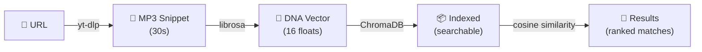
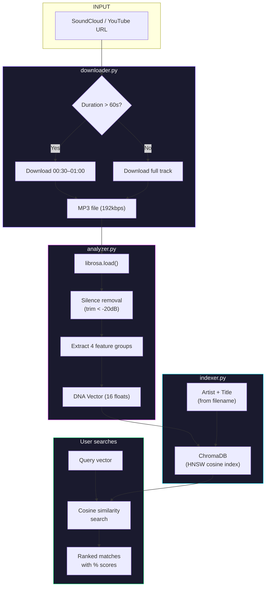
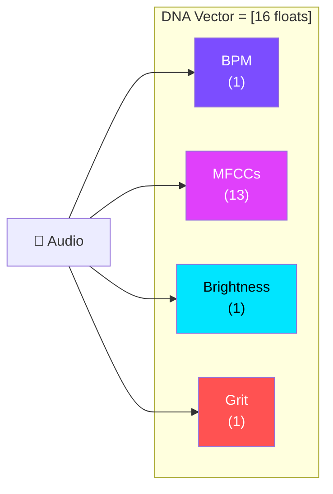
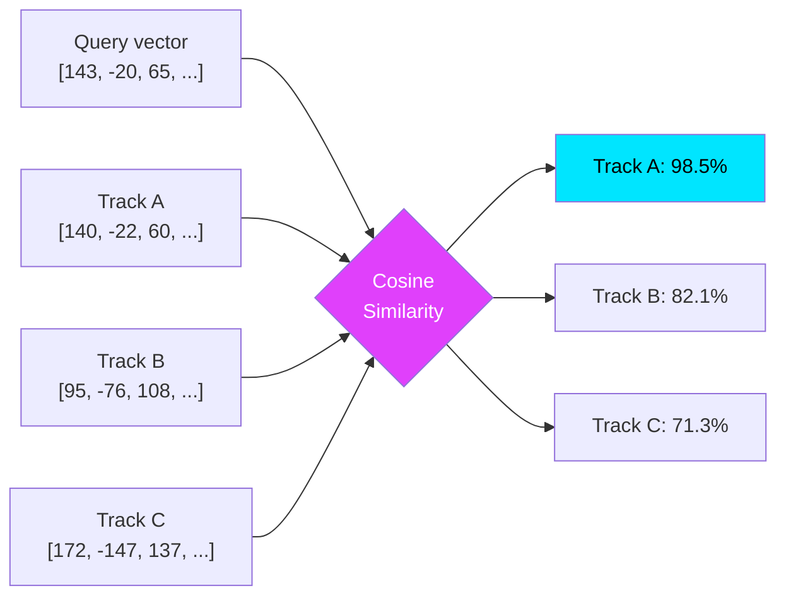
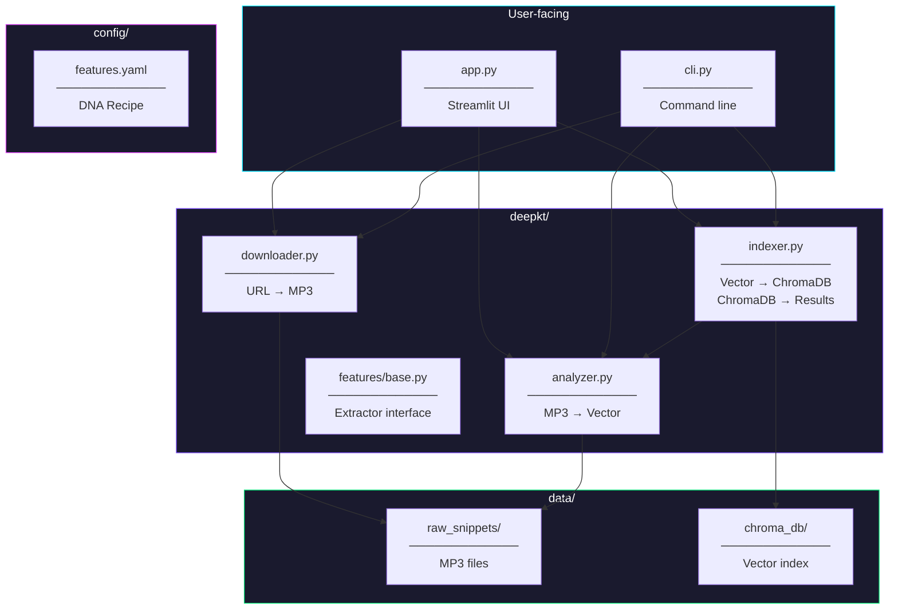
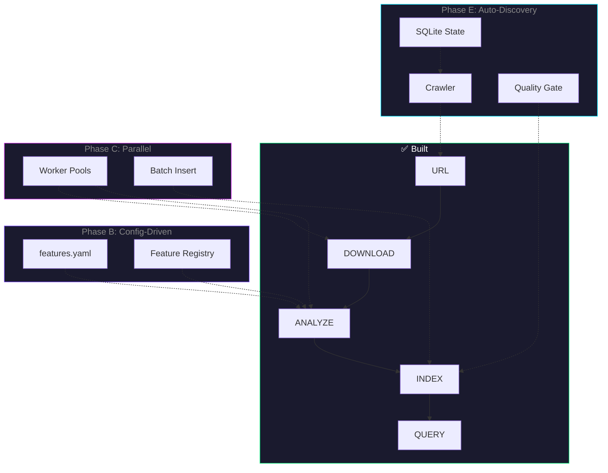

# Deepkt Pipeline — Visual Guide

## The Big Picture

Every track goes through a linear pipeline that transforms a URL into a searchable point in "Vibe Space."



---

## Data Flow — What Happens to a Track



---

## The DNA Vector — What's Inside

A single track becomes **16 numbers**. Each number captures a different dimension of the sound:

```
Index   Feature              What it measures                   Example values
─────   ──────────────────   ──────────────────────────────     ──────────────
[0]     BPM                  Energy / speed                     95 – 172
[1-13]  MFCCs (13 values)    Timbre / texture / "grit"          -148 to +137
[14]    Spectral Centroid    Brightness (high=EDM, low=bass)    1200 – 4500
[15]    Zero-Crossing Rate   Noisiness / distortion             0.03 – 0.15
```



---

## How Similarity Search Works



**Cosine similarity** measures the *angle* between two vectors, ignoring magnitude. Two tracks with the same *proportions* of grit, brightness, and tempo score high — even if one is louder.

---

## File Map — Where Code Lives



---

## Vibe Sliders — How They Work

The UI vibe sliders don't re-analyze audio. They **modify the query vector** before searching:

```
Original vector:   [143,  -20, ...,  2800,  0.08]
                     ↑BPM              ↑Bright  ↑Grit

Tempo +20:         [163,  -20, ...,  2800,  0.08]   ← shifted BPM
Brightness +30:    [143,  -20, ...,  4300,  0.08]   ← shifted centroid  
Grit +40:          [143,  -20, ...,  2800,  0.28]   ← shifted ZCR
```

This moves the "search point" in Vibe Space without downloading or re-analyzing anything.

---

## Future Pipeline (Phase B+)


